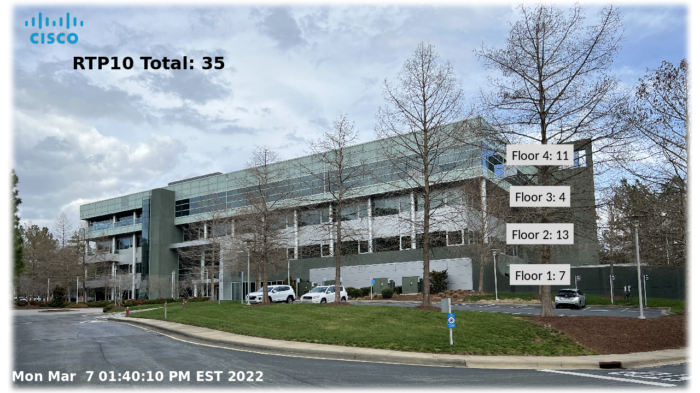

# Powerpoint to Dashboard

The DevNet Powerpoint to Dashboard (PPTX2Dashboard) project is one of
many coding innovations developed to help you, our Cisco customers, in
your automation projects, whether you are a network engineer early in 
your journey with network automation, an existing InfraDev, or a 
seasoned AppDev. These projects are based on leading practices 
developed in the Network Operations Center (NOC) for CiscoLive 
conference events in the US and Europe.  

This specific project provides an ability to convert a Microsoft
Powerpoint (pptx) file embedded with unique, static data placeholders 
into a webpage/dashboard that is updated with variables from a 
cross-reference file. You have the opportunity to use graphic artists 
or your own Powerpoint skills to layout a dashboard in whatever way 
suits your need. You can represent network topologies, buildings - 
anything that appeals to your data visualization intents.

You define unique data placeholders to identify where dynamic data 
should appear. You provide a cross-reference file that maps the unique 
placeholder tags to the actual data, then run the script. It will swap 
the placeholders for the dynamic values, run an image conversion 
process, then push to an Apache webserver publication directory.

The business driver for this was to enable customer flexible dashboards
without requiring the network management SME, DevOps engineer or SRE to 
interpret the visualization intent. The SME can focus on the method for 
obtaining the instrumentation/telemetry and allow a graphic artist or 
Powerpoint SME to design the optimal layout.

## Technology Stack /  Architecture overview
Below is the overall architecture for the project.

<kbd></kbd>

Other things you might include: N.A.

## Status
v1.0 released to Automation Exchange
This is based on technology and processes used for over 7 years in the CiscoLive NOC.

## Screenshot / Output
<kbd></kbd>

## Use Case Description
This project solves Dashboard visualization needs by enabling the use
of the popular Microsoft Powerpoint to provide custom layout templates 
for representating topology, asset location or other graphics.

## Installation

Two options are provided: self-directed installation with requirements 
OR Docker.  Pick whichever suits your preference, security requirements 
and deployment capabilities.
When running as a self-directed installation with requirements, it is 
suggested to run this project in its own Linux Virtual Machine.  
Development was done on Ubuntu 20.10, but other Linux variants should
be fine.
Apache and Python3 environments should be installed - Ubuntu may have 
provided these in your installation.  Our guidance is to keep the 
system-supplied version and install the latest Python and use virtual 
environments (venv) to maintain separation of environments from the core 
operating system.  Our development was done on Python v3.9.1, but 
anything above v3.7 should be sufficient.
Additionally, [libreoffice](https://www.libreoffice.org/) should be 
installed. Only the Impress module is needed, which mimics the function 
of Powerpoint. So a minimum VM install would include the libre-impress 
package. 
See the (INSTALL)[/docs/INSTALL.md] guidance for more detail.

## Known issues
None known at this time.

## Getting help
For additional help, look to the [DevNet Developer Support](https://developer.cisco.com/site/support/) team.  If major enhancements are requested, the [Cisco Customer Experience (CX) team](https://www.cisco.com/c/m/en_us/customer-experience/index.html) can be engaged for transactional assistance.  

If you have questions, concerns, bug reports, etc., please create an issue against this repository.

## Getting involved
 _How_ to contribute is found in the [CONTRIBUTING](./CONTRIBUTING.md) file.

## Credits and references
1. N.A.
2.
----

## Licensing info

See the [LICENSE](./LICENSE).

----
